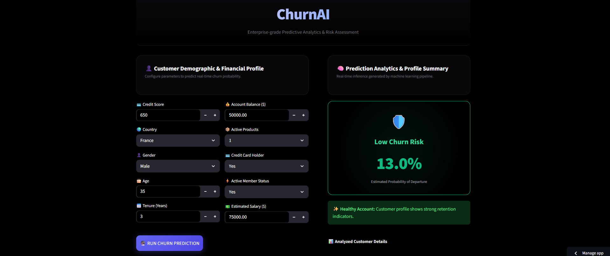
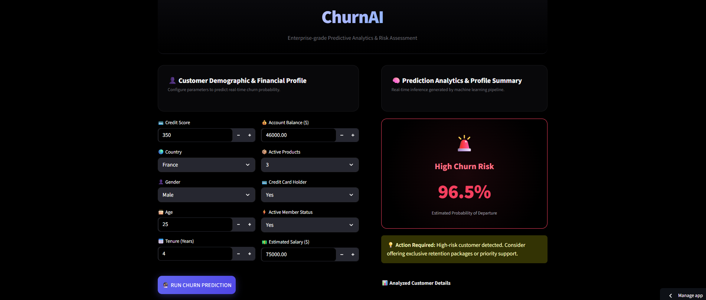

# 🏦 Bank Customer Churn Prediction

A Machine Learning project that predicts whether a bank customer is likely to **churn** based on customer demographics, account information, financial behavior, and other relevant features.

🔗 **[Bank Customer Churn — Live Project](https://bank-customer-churn-prediction-princebuildsai.streamlit.app/)**

---

## 📸 Project Preview

<table align="center">
  <tr>
    <td style="border: 2px solid #00aaff; border-radius: 12px; padding: 6px; box-shadow: 0 0 15px #00aaff;">
      
    </td>
    <td style="border: 2px solid #00aaff; border-radius: 12px; padding: 6px; box-shadow: 0 0 15px #00aaff;">
      
    </td>
  </tr>
</table>

---

## ✨ Project Highlights

| Feature            | Details                       |
| ------------------ | ----------------------------- |
| 🏦 Domain          | Banking & Customer Analytics  |
| 🎯 Prediction Task | Customer Churn Classification |
| 🤖 ML Approach     | Supervised Machine Learning   |
| 📌 Target          | Customer Churn / Retention    |
| 🔢 Problem Type    | Binary Classification         |
| 📊 Input           | Customer & Account Features   |
| 🌐 Deployment      | Streamlit                     |
| 💾 Model           | Saved ML Model                |
| ⚡ Prediction       | Real-Time                     |

---

## 🎯 Project Objective

Customer churn is an important challenge in the banking industry.

The goal of this project is to build a Machine Learning system that can analyze customer information and predict whether a customer is likely to **leave the bank**.

This can help businesses:

* 🔍 Identify high-risk customers
* 📊 Understand customer behavior
* 🎯 Prioritize retention efforts
* 💡 Support data-driven decisions
* 💰 Reduce potential customer loss

---

## 🤖 Machine Learning Approach

The project follows a complete Machine Learning workflow:

```text
Customer Data
      ↓
Data Cleaning
      ↓
Exploratory Data Analysis
      ↓
Feature Engineering
      ↓
Data Preprocessing
      ↓
Model Training
      ↓
Model Evaluation
      ↓
Churn Prediction
      ↓
Streamlit Deployment
```

---

## 📊 Prediction

The model performs **binary classification**:

```text
0 → Customer is likely to stay
1 → Customer is likely to churn
```

The trained model analyzes the customer's characteristics and generates a churn prediction that can be used as an early-warning signal.

---

## 🔬 Key Machine Learning Concepts

This project demonstrates practical experience with:

* 🧹 Data Cleaning
* 🔍 Exploratory Data Analysis
* ⚙️ Data Preprocessing
* 🏗️ Feature Engineering
* 📈 Model Training
* 🎯 Classification
* 📊 Model Evaluation
* 🔧 Feature Scaling
* 💾 Model Serialization
* 🌐 Model Deployment

---

## 🛠️ Tech Stack

### Programming

* 🐍 Python

### Data Analysis

* 🐼 Pandas
* 🔢 NumPy

### Visualization

* 📊 Matplotlib
* 📈 Seaborn

### Machine Learning

* 🤖 Scikit-learn
* 🎯 Classification Algorithms
* ⚙️ Feature Scaling

### Deployment

* 🌐 Streamlit

### Model Management

* 💾 Joblib

---

## 🖥️ Interactive Web Application

The trained Machine Learning model is integrated with **Streamlit**, allowing users to enter customer information and receive a real-time churn prediction through an interactive interface.

### Application Flow

```text
User Input
    ↓
Preprocessing
    ↓
Trained ML Model
    ↓
Churn Prediction
    ↓
Result Display
```

🔗 **[Open Bank Customer Churn App](https://bank-customer-churn-prediction-princebuildsai.streamlit.app/)**


---

## 💡 Business Impact

This project demonstrates how Machine Learning can convert customer data into **actionable business intelligence**.

A bank can use churn predictions to identify customers who may be at risk of leaving and potentially take proactive steps such as personalized offers, improved services, or targeted engagement.

> **Predict churn early → Understand customer risk → Take proactive action**

---

## 🚀 Why This Project Matters

Customer churn prediction is a practical Machine Learning use case with direct business value.

This project combines:

**Data Analysis + Machine Learning + Business Understanding + Model Deployment**

to create an end-to-end solution rather than only training a model inside a notebook.

---

## 🔮 Future Improvements

* 📊 Add customer churn probability visualization
* 🎯 Add feature importance analysis
* 🤖 Experiment with advanced ensemble models
* 🧠 Add Explainable AI using SHAP
* 📈 Build customer segmentation
* 💡 Generate personalized retention recommendations
* ☁️ Deploy an optimized production version
* 📋 Add automated model monitoring

---

## 🎯 Skills Demonstrated

**Python • Pandas • NumPy • Data Analysis • EDA • Feature Engineering • Machine Learning • Classification • Scikit-learn • Model Evaluation • Joblib • Streamlit • Model Deployment • Business Analytics**

---

## 👨‍💻 Author

**PrinceBuildsAI**

Built as a practical Machine Learning project to explore how AI can predict customer churn and transform banking data into actionable customer retention insights.

---

⭐ **If you found this project interesting, consider giving the repository a star!**
